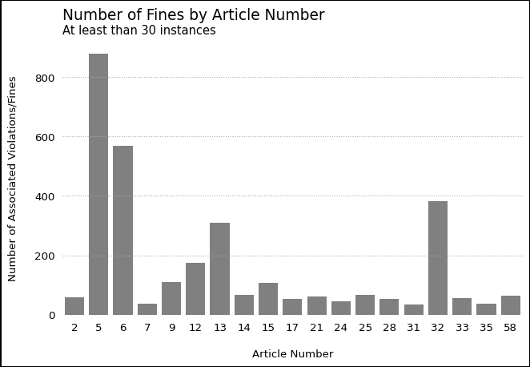

# GDPR Fines Regression Analysis
David Currie
2023-11-27

<!--small amount of styling -->
<style>
code {
    color: midnightblue;
}
</style>

## Background

This report was produced in Nov 2023 and focusses on exploratory
analysis of GDPR penalties. GDPR [(General Data Protection
Regulation)](https://gdpr-info.eu/), which aims to protect the
information of European Union citizens, took affect in May 2018.

## Setup

``` python
import numpy as np
import pandas as pd
import matplotlib.pyplot as plt
import matplotlib as mpl
import seaborn as sns
import textwrap
import statsmodels.api as sm

# helper functions
from scripts.wrangling_funs import filter_for_positives, strip_text_col, pivot_fines_longer, replace_accent_characters

# plot styles
import params.plt_params
```

### Data

The data for this report is scraped from: [Privacy Affairs: GDPR Fines
List](https://www.privacyaffairs.com/gdpr-fines/). The data is then
transformed into a tabular format and written to
`data/scraped_gdpr_fines.csv` This can be recreated by running:

``` python
python scripts/scrape_gdpr_fines.py
```

``` python
fines = pd.read_csv(
    "data/scraped_fines.csv",
    parse_dates=["date"]
    )
```

The data consists of 1701 rows of 11 variables. Each row of data relates
to a single occurence of GDPR violation along with it’s penalty amount
(fine), the local controller, the organisation found in violation, and
the articles of GDPR they were found in violation of.

``` python
with pd.option_context("display.precision", 2):
    display(
        fines
        .drop(columns="id")
        .describe(include=[object])
        .transpose()
        )
```

<div class="cell-output cell-output-display">

<div>
<style scoped>
    .dataframe tbody tr th:only-of-type {
        vertical-align: middle;
    }
&#10;    .dataframe tbody tr th {
        vertical-align: top;
    }
&#10;    .dataframe thead th {
        text-align: right;
    }
</style>

|                 | count | unique | top                                               | freq |
|-----------------|-------|--------|---------------------------------------------------|------|
| picture         | 1701  | 31     | https://www.privacyaffairs.com/wp-content/uplo... | 594  |
| name            | 1701  | 32     | Spain                                             | 594  |
| authority       | 1701  | 76     | Spanish Data Protection Authority (AEPD)          | 590  |
| controller      | 1701  | 1222   | Unknown                                           | 89   |
| articleViolated | 1701  | 635    | Art. 5 GDPR, Art. 6 GDPR                          | 113  |
| type            | 1699  | 49     | Failure to comply with data processing principles | 558  |
| source          | 273   | 238    | https://www.cpdp.bg/index.php?p=element&aid=1219  | 7    |
| summary         | 1701  | 1670   | Not available.                                    | 6    |

</div>

</div>

``` python
with pd.option_context("display.precision", 2):
    display(
        fines
        .drop(columns='id')
        .describe(include=[np.number])
        .transpose()
        )
```

<div class="cell-output cell-output-display">

<div>
<style scoped>
    .dataframe tbody tr th:only-of-type {
        vertical-align: middle;
    }
&#10;    .dataframe tbody tr th {
        vertical-align: top;
    }
&#10;    .dataframe thead th {
        text-align: right;
    }
</style>

|       | count  | mean     | std      | min | 25%    | 50%    | 75%     | max      |
|-------|--------|----------|----------|-----|--------|--------|---------|----------|
| price | 1701.0 | 2.35e+06 | 3.80e+07 | 0.0 | 2000.0 | 6000.0 | 40000.0 | 1.20e+09 |

</div>

</div>

The minumum value of fines is 0. This seems incorrect (and worth
investigating!) but with the assumption that fines should fall in the
range $0 \lt \textrm{fine amount} \lt \infty$. Before performing
analysis a minor amount of cleaning is required for the ‘raw’ data

1.  remove fines with 0 price
2.  remove whitespace from type column

``` python
fines_nozero = (
    fines
    .pipe(filter_for_positives, "price")
    .pipe(strip_text_col, "type")
    .pipe(replace_accent_characters, "controller")
)
```

After cleaning the data there are now 1617 rows of 11 variables.

``` python
with pd.option_context("display.precision", 2):
    display(
        fines_nozero
        .drop(columns='id')
        .describe(include=[np.number])
        .transpose()
        )
```

<div class="cell-output cell-output-display">

<div>
<style scoped>
    .dataframe tbody tr th:only-of-type {
        vertical-align: middle;
    }
&#10;    .dataframe tbody tr th {
        vertical-align: top;
    }
&#10;    .dataframe thead th {
        text-align: right;
    }
</style>

|       | count  | mean     | std      | min  | 25%    | 50%    | 75%     | max      |
|-------|--------|----------|----------|------|--------|--------|---------|----------|
| price | 1617.0 | 2.47e+06 | 3.89e+07 | 28.0 | 2000.0 | 7000.0 | 45000.0 | 1.20e+09 |

</div>

</div>

## Data Exploration

Through visualisation the following questions will be explored. This is
with the goal of understanding: The financial penalty (fine amount),
poor data controllers, particular articles.

**On the Fine Amount: **

1.  How are the fine amounts distributed?
2.  How does the distribution of fine amount change over time?

**On the Controllers: **

1.  Who pays the most?
2.  Who pays the most often?

**On the Articles: **

1.  Which articles are referenced the most often
2.  What is the distribution of fine amounts where that article is
    referenced?

### Fine Value

Questions on the fine amount:

1.  How are the fine amounts distributed?
2.  How does the distribution of fine amount change over time?

#### How are the fines distributed?

``` python
def big_currency(x, pos):
    """Lots of big amounts paid in fines. (> 1 billion sometimes)"""
    if x >= 1e9:
        return '{:1.1f}B €'.format(x*1e-9)
    if x >= 1e6:
        return '{:1.0f}M €'.format(x*1e-6)
    
    return '{:1.0f} €'.format(x)
```

``` python
fig, ax = plt.subplots()

sns.histplot(
    fines_nozero, x="price",
    edgecolor="white", linewidth=.5, facecolor="midnightblue",
    log_scale=True, binrange=(0, 10), bins=20,
    ax=ax
)
for bar in ax.patches:
    bar.set_alpha(0.70) 

ax.set(xlabel= None, ylabel=None)
ax.xaxis.set_major_formatter(big_currency)

fig.supylabel(t="GDPR Violations")
fig.supxlabel(t="GDPR Fine (Euro)")

fig.canvas.draw()

fig.suptitle(
    t="GDPR Fine Distributions (Log Scale)", 
    x=ax.get_position().x0,
    y=ax.get_position().y1,
    ha="left", fontsize=14,
)

fig.patch.set_linewidth(1)
fig.patch.set_edgecolor("black")
plt.show()
```


By visualising the distribution of fines as a simple histogram it was
immediately clear there was a large degree of right-skew. This is
typical with financial data. Because of the high right-skew, the
decision was made to visualise the data on a logarithmic scale.

<a href="#tbl-data-price-col2" class="quarto-xref">Table 3</a> shows the
five figure summary of the price column. Fine value ranges from 28 to
1,200,000,000.

Most of the fines fall between 1000 and 100,000 Euros.

#### How does the distribution of fines change over time?

Looking at each year’s distribution of fines as a boxplot allows for
them to be compared. If they boxes move up the y-axis it would give
credence that the fine values are increasing over time.

By including the actual data points (each fine occurence) as an
overlayed jitters, it’s also possible to see if the number of fines is
increasing.

``` python
df = (fines_nozero.assign(
    year = lambda x: x.date.dt.year
))

# make data more friendly for matplotlib
prices_each_year = df.groupby('year')['price'].apply(lambda x: x.values)

# Get the years as labels
labels = list(prices_each_year.keys())
labels.sort()

#create a figure with subplots
fig, ax = plt.subplots(1, 2,
                       gridspec_kw={'width_ratios': [1, 7]},
                       sharey=True)

# Create a boxplot for the year 1970
box1 = ax[0].boxplot(
    prices_each_year[1970],
    labels=['1970'], widths=0.4, showfliers=False,
    medianprops={'color':'black', 'linewidth':2}
    )
ax[0].set_ylabel(None)


# Create a boxplot for the years other than 1970
years_other_than_1970 = [year for year in labels if year != 1970]
box2 = ax[1].boxplot(
    [prices_each_year[year] for year in years_other_than_1970],
    labels=years_other_than_1970, showfliers=False, widths=0.4,
    medianprops={'color':'black', 'linewidth':2}
    )

# smaller caps
for box in list((box1, box2)):
    for cap in box['caps']:
        cap.set_xdata(cap.get_xdata() - [-0.05, 0.05])

ax[1].set_ylabel(None)

jittered_x = np.random.normal(0 + 1, 0.1, len(prices_each_year[1970]))
ax[0].scatter(jittered_x, prices_each_year[1970], alpha=0.05, color='midnightblue', s=10)


# Overlay the data points for the years other than 1970
for i, year in enumerate(years_other_than_1970):
    jittered_x = np.random.normal(i + 1, 0.1, len(prices_each_year[year]))
    ax[1].scatter(jittered_x, prices_each_year[year], alpha=0.05, color='midnightblue', s=10)

# delineate the year jump
ax[1].spines.left.set_visible(True)
ax[1].set_yscale('log')
ax[1].yaxis.set_major_formatter(big_currency)

# draw the figure to apply constrained_layout (req for positioning suptitle)
fig.canvas.draw()

fig.supylabel("Price [Log Distribution]")
fig.suptitle(
    t="How has the distribution of fines changed over time?", 
    ha='left',
    x=ax[0].get_position().x0+0.03,
    fontsize=14,
    y=ax[0].get_position().y1*1.015,
    va='top'
)

# subtitle
plt.figtext(x=ax[0].get_position().x0+0.03, y=ax[0].get_position().y1*0.925, s="GDPR Fine Distributions Over Time (Log Scale)", va="bottom", ha="left", size=11)

fig.patch.set_linewidth(1)
fig.patch.set_edgecolor("black")
plt.show()
```


Several fines are labelled as being given in 1970. It looks like this
was this data’s way of encoding `NA` for the date of fine (GDPR didn’t
come into practice until 2018.)

The other boxes only vary slightly. They all show Q1 above 1000, Q2
(median around 10000) and Q3 between 10000 and 100000. One notable
exception is 2022 which is lower on the y axis.

Looking at the number of data points per year it looks like 2022 had
more GDPR fines than any other year.

This report was conducted late in 2023. While this may explain why there
are fewer points on the 2023 box, it still looks like there will be
fewer fines than in previous years.

It doesn’t look as if there is a clear trend in the distribution of
fines.

### Controllers

1.  Who pays the most?
2.  Who pays the most often?

Some data wrangling is required to create a summary view for each
controller. Ideally for each separate controller it would be good to
construct a table with:

- the controller name
- the number of times that controller has been fined
- the sum of the fines that controller has had to pay
- the mean of the fines that controller has had to pay

This is useful for direct comparison.

The large companies (e.g. Meta, Amazon) often have multiple different
controller names. For simplicity in communication these have been
combined (i.e. Meta/Facebook refers to any controller regarding
Meta/Facebook: Meta Platforms Inc. (Facebook), Meta Platforms Ireland
Limited (Facebook), etc.)

``` python
def strfind(series, term):
    """"
    time-saver function
    """
    return series.str.contains(term, case=False)

# Give multi-national corps standard names
# Facebook/Meta Ireland -> Facebook/Meta
fines_controller_gb = (
    fines_nozero
    .assign(
        shortname = lambda x: np.select(
            [strfind(x.controller, "Facebook"), strfind(x.controller, "Meta "), strfind(x.controller, "Amazon"),
             strfind(x.controller, "Google"), strfind(x.controller, "Microsoft"), strfind(x.controller, "Vodafone"),
             strfind(x.controller, "WhatsApp"), strfind(x.controller, "Clearview"), strfind(x.controller, "H&M"),
             strfind(x.controller, "Marriott"), strfind(x.controller, "Telefonica Moviles")],
            ["Facebook/Meta", "Facebook/Meta", "Amazon",
             "Google", "Microsoft", "Vodafone",
             "WhatsApp", "Clearview AI", "H&M",
             "Marriot", "Telefonica Moviles Espana"],
            x.controller
        )
    )
    .assign(shortname = lambda x: x.shortname.str.title().str.strip())
    .groupby('shortname')
)

controller_counts = fines_controller_gb.size().to_frame(name='counts')
controller_stats = (
    controller_counts
    .join(fines_controller_gb.agg({'price':'sum'}).rename(columns={'price':'total_price'}))
    .join(fines_controller_gb.agg({'price':'mean'}).rename(columns={'price':'mean_price'}))
    .reset_index()
)

with pd.option_context(
    "display.float_format", '{:,.2f}'.format):
    display(
        controller_stats
        .sort_values('total_price', ascending=False)
        .head(10)
    )
```

<div>
<style scoped>
    .dataframe tbody tr th:only-of-type {
        vertical-align: middle;
    }
&#10;    .dataframe tbody tr th {
        vertical-align: top;
    }
&#10;    .dataframe thead th {
        text-align: right;
    }
</style>

|      | shortname              | counts | total_price | mean_price     |
|------|------------------------|--------|-------------|----------------|
| 412  | Facebook/Meta          | 7      | 2337051000  | 333,864,428.57 |
| 49   | Amazon                 | 3      | 748020000   | 249,340,000.00 |
| 1097 | Whatsapp               | 2      | 230500000   | 115,250,000.00 |
| 471  | Google                 | 7      | 215600028   | 30,800,004.00  |
| 237  | Clearview Ai           | 5      | 74200000    | 14,840,000.00  |
| 486  | H&M                    | 1      | 32258708    | 32,258,708.00  |
| 1007 | Tim - Telecom Provider | 1      | 27800000    | 27,800,000.00  |
| 387  | Enel Energia S.P.A.    | 1      | 26500000    | 26,500,000.00  |
| 173  | British Airways        | 1      | 22046000    | 22,046,000.00  |
| 646  | Marriot                | 1      | 20450000    | 20,450,000.00  |

</div>

#### Who pays the most?

With the data in this form (each row being a single controller) and the
variables relating to statistics on their fines, the controllers with
the highest total amount in fines paid can be found easily. First by
sorting the data based on `total_price`, then by visualising those
totals for the top n rows. In this case `n = 10`.

``` python
TOP_N = 10

fig, ax = plt.subplots()

sns.barplot(y='shortname', x='total_price', data=controller_stats.nlargest(TOP_N, columns='total_price'),
            color='midnightblue', ax=ax, orient='h', alpha=0.8)

ax.set(xlabel="\nTotal Amount Paid in Fines", ylabel=None)
ax.xaxis.set_major_formatter(big_currency)

# wrap long labels
ax.set_yticks(ax.get_yticks()) # this just avoids a userWarning error 
f = lambda x: textwrap.fill(x.get_text(), 20)
ax.set_yticklabels(map(f, ax.get_yticklabels()))

fig.canvas.draw()
ax.set_title(label=f"Total Amount Paid in Fines Controllers (Top {TOP_N})", loc="left", ha="left", size=11)
fig.suptitle(
    t="Who Pays the Most?", ha='left', fontsize=14,
    x=ax.get_position().x0,
    y=ax.get_position().y1*0.975
    )

fig.patch.set_linewidth(1)
fig.patch.set_edgecolor("black")
plt.show()
```


What should be immediately clear is that Facebook/Meta have paid such
large amounts in GDPR-violation fines that it becomes difficult to
assess the scale of other companies’ violations.

According to this data, Facebook/Meta have had to pay: 2,337,051,000in
fines.

#### Who Pays the Most Often?

From the collapsed controller statistics the number of recorded
violations is immediately available for plotting too. This is the number
of times each controller has been found in violation of one or more GDPR
articles and has been fined.

One note: some controller names don’t relate to companies or are
uninformative (“Unknown Company”, “Not Available”). These have therefore
been removed before plotting.

``` python
# some controller names are uninformative
DONT_INCLUDE = ["Unknown", "Unknown Company", "Not Available"]
TOP_N = 10

fig, ax = plt.subplots()

sns.barplot(
    y='shortname', x='counts',
    data=controller_stats.query(f'~shortname.isin({DONT_INCLUDE})').nlargest(n=TOP_N, columns='counts'),
    color='midnightblue', ax=ax, orient='h', alpha=0.8
    )

ax.set(
    xlabel="\nn Times Fined", ylabel=None,
    xticks=range(0, controller_stats.counts.max(), 10)
    )

# wrap long labels
ax.set_yticks(ax.get_yticks()) # this just avoids a userWarning error 
f = lambda x: textwrap.fill(x.get_text(), 20)
ax.set_yticklabels(map(f, ax.get_yticklabels()))

fig.canvas.draw()

# title and subtitle
ax.set_title(
    label=f"Number of Times Each Controller has been Fined (Top {TOP_N})", loc="left", ha="left", size=11)
fig.suptitle(
    t="Who Pays the Most Often?", ha='left', fontsize=14,
    x=ax.get_position().x0,
    y=ax.get_position().y1*0.975
    )

fig.patch.set_linewidth(1)
fig.patch.set_edgecolor("black")
plt.show()
```


The plot shows that the most frequently-fined controller is “Private
Individual”. Since this more likely relates to many different
individuals, it’s also probably worth looking at the results without
these non-specific identifiers. I.e. without terms like: “Private
Individual”, “Company”, “Store Owner”, “Police Officer”, …

``` python
# some controller names don't relate to specific companies or are uninformative
DONT_INCLUDE = ["Unknown", "Unknown Company", "Not Available", "Not Disclosed", "Private Individual", "Company", "Homeowners Association", "Store Owner", "Police Officer", "Website Operator", "Bank", "Employer", "Physician", "Restaurant", "Retailer", "Covid-19 Test Center", "Private Person", "..", "Political Party", "Telecommunication Service Provider"]

TOP_N = 10

fig, ax = plt.subplots()

sns.barplot(
    y='shortname', x='counts',
    data=controller_stats.query(f'~shortname.isin({DONT_INCLUDE})').nlargest(n=TOP_N, columns='counts'),
    color='midnightblue', ax=ax, orient='h', alpha=0.8
    )

ax.set(
    xlabel="\nn Times Fined", ylabel=None,
    xticks=range(0, controller_stats.counts.max(), 10)
    )


# wrap long labels
ax.set_yticks(ax.get_yticks()) # this just avoids a userWarning error 
f = lambda x: textwrap.fill(x.get_text(), 20)
ax.set_yticklabels(map(f, ax.get_yticklabels()))

fig.canvas.draw()


# title and subtitle
ax.set_title(
    label=f"Number of Times Each Controller has been Fined (Top {TOP_N})", loc="left", ha="left", size=11)
fig.suptitle(
    t="Who Pays the Most Often?", ha='left', fontsize=14,
    x=ax.get_position().x0,
    y=ax.get_position().y1*0.975
    )

fig.patch.set_linewidth(1)
fig.patch.set_edgecolor("black")
plt.show()
```


This is a bit cleaner. It’s clear that apart from 3, controllers
typically haven’t been fined more than 10 times. Vodafone are the
surprise here, with over 80 incidences of GDPR violations.

During the filtering the following were excluded but they are of
interest that these ‘classes’ of organisation are often found in
violation of GDPR. In descending order:

``` python
INCLUDE = ["Private Individual", "Company", "Homeowners Association", "Store Owner", "Police Officer", "Website Operator", "Bank", "Employer", "Physician", "Restaurant", "Retailer", "Covid-19 Test Center", "Private Person", "Political Party", "Telecommunication Service Provider"]

(
    controller_stats
    .query(f'shortname.isin({INCLUDE})')
    .sort_values('counts',  ascending=False)
)    
```

<div class="cell-output cell-output-display" execution_count="35">

<div>
<style scoped>
    .dataframe tbody tr th:only-of-type {
        vertical-align: middle;
    }
&#10;    .dataframe tbody tr th {
        vertical-align: top;
    }
&#10;    .dataframe thead th {
        text-align: right;
    }
</style>

|      | shortname                          | counts | total_price | mean_price    |
|------|------------------------------------|--------|-------------|---------------|
| 802  | Private Individual                 | 98     | 167250      | 1706.632653   |
| 259  | Company                            | 25     | 306323      | 12252.920000  |
| 501  | Homeowners Association             | 16     | 22420       | 1401.250000   |
| 959  | Store Owner                        | 12     | 14140       | 1178.333333   |
| 784  | Police Officer                     | 9      | 13428       | 1492.000000   |
| 1095 | Website Operator                   | 8      | 18550       | 2318.750000   |
| 134  | Bank                               | 7      | 151870      | 21695.714286  |
| 385  | Employer                           | 6      | 34211       | 5701.833333   |
| 772  | Physician                          | 6      | 13200       | 2200.000000   |
| 857  | Restaurant                         | 6      | 19470       | 3245.000000   |
| 862  | Retailer                           | 6      | 17267       | 2877.833333   |
| 300  | Covid-19 Test Center               | 5      | 23300       | 4660.000000   |
| 805  | Private Person                     | 5      | 15600       | 3120.000000   |
| 787  | Political Party                    | 4      | 24300       | 6075.000000   |
| 989  | Telecommunication Service Provider | 4      | 432213      | 108053.250000 |

</div>

</div>

### Article References

At present, the clean fines data is structured such that each row
represents a single instance of an entity being fined in violation of
one or more GDPR articles. It’s possible for a single fine to be in
reference to multiple articles being violated. To look at specific
article violations (i.e. one row per article violation) the data will
need to pivoted longer. After the data have been put into a longer
format, each individual article can be counted using pandas
`pd.DataFrame.value_counts()`.

``` python
fines_long = pivot_fines_longer(fines_nozero)

# df showing article next to how often it was referenced.
n_citations = (
    fines_long
    .value_counts('article_number')
    .reset_index(name='count')
    .sort_values('article_number')
)
```

#### Which articles are referenced the most often?

There are over 50 different article numbers recorded. Looking at only
articles refernced at least 30 times:

``` python
MIN_OCCURENCES = 30

fig, ax = plt.subplots()

sns.barplot(
    x='article_number', y='count',
    data=n_citations.query(f'count >= {MIN_OCCURENCES}'),
    orient='v', color='grey', ax=ax
    )

ax.tick_params(axis='y', which='major')
ax.set(
    xlabel='\nArticle Number',
    ylabel='Number of Associated Violations/Fines\n'
    )

fig.canvas.draw()

# title + subtitle
ax.set_title(f'At least than {MIN_OCCURENCES} instances', loc='left', fontsize=11)
fig.suptitle('Number of Fines by Article Number', x=ax.get_position().x0, ha='left', fontsize=14, y=ax.get_position().y1*0.975)

fig.patch.set_linewidth(1)
fig.patch.set_edgecolor("black")
plt.show()
```



We can see from the barplot that articles 5, 6, 13, and 32 are the most
frequently referrenced articles (all over 200 instances). With 5 being
the most frequently referrenced article (over 800 times alone)

#### Distribution of Fine Price per Article

For the fines referenced over 30 times, how are the fines distributed.
Here each point on the plot relates to a fine of that article. That is,
if there is an instance where articles 5, and 13 were referenced, there
will be a point for article 5 and article 13 at
$y = \textrm{total\_fine\_euro}$.

Similar to
<a href="#fig-distribution-by-year" class="quarto-xref">Figure 2</a>,
it’s possible to compare the number of references per article since the
points have been overlayed with a jitter effect.

``` python
MIN_OCCURENCES = 30

df = (
    n_citations
    .query(f'count >= {MIN_OCCURENCES}')
    .merge(fines_long, how='inner', left_on='article_number', right_on='article_number')
)

fig, ax = plt.subplots()

sns.stripplot(
    x='article_number', y='total_fine_euro', data=df,
    color='black', jitter=0.15, size=3.5, alpha=0.05,
    ax=ax, zorder=1
)

sns.boxplot(
    x='article_number', y='total_fine_euro', data=df,
    ax=ax,
    showfliers=False,
    boxprops={'facecolor':'none'}
)

ax.set_yscale("log")
ax.set(xlabel="\nArticle Number", ylabel="Total Fine (€) [Logarithmic Scale]\n")
ax.yaxis.set_major_formatter(big_currency)

fig.canvas.draw()

# title + subtitle
ax.set_title(f'At least than {MIN_OCCURENCES} instances', loc='left', fontsize=11)
fig.suptitle('Distribution of Total Fine per Article\'s inclusion', x=ax.get_position().x0, ha='left', fontsize=14, y=ax.get_position().ymax*0.975)

ax.grid(visible=True, axis="both")

fig.patch.set_linewidth(1)
fig.patch.set_edgecolor("black")
plt.show()
```


It’s not immediately clear that any particle article relates to an
approximate increase or decrease in fine amount.

There is perhaps some cause to suggest that the more infrequent article
references sometimes correlate with a higher fine amount.

## Regression Analysis

### Creating a dataset for Modelling

``` python
MIN_CITATIONS = 30
INTEREST_VARS = ['year', 'article_number']

# pivot data
gdpr_model_data = (
    # note we're starting with fines_long here
    fines_long
    .assign(
        violated        = 1,
        total_fine_euro = lambda x: np.log10(x.total_fine_euro),
        year            = lambda x: x.date.dt.year
    )
    .merge(
        n_citations.query(f'count >= {MIN_CITATIONS}'),
        how='inner', left_on='article_number', right_on='article_number'
        )
    .pivot_table(values=['violated'], index=['id', 'total_fine_euro'] + INTEREST_VARS)
    .unstack(level=-1, fill_value=0)
)


# sort out indexing / columns
gdpr_model_data.columns = gdpr_model_data.columns.droplevel(0)
gdpr_model_data.columns.name = None

gdpr_model_data.columns = ['A' + str(col) for col in gdpr_model_data.columns]

gdpr_model_data.reset_index(inplace=True)
```

``` python
gdpr_model_data
```

<div>
<style scoped>
    .dataframe tbody tr th:only-of-type {
        vertical-align: middle;
    }
&#10;    .dataframe tbody tr th {
        vertical-align: top;
    }
&#10;    .dataframe thead th {
        text-align: right;
    }
</style>

|      | id   | total_fine_euro | year | A2  | A5  | A6  | A7  | A9  | A12 | A13 | ... | A17 | A21 | A24 | A25 | A28 | A31 | A32 | A33 | A35 | A58 |
|------|------|-----------------|------|-----|-----|-----|-----|-----|-----|-----|-----|-----|-----|-----|-----|-----|-----|-----|-----|-----|-----|
| 0    | 1    | 3.972203        | 2019 | 0.0 | 0.0 | 0.0 | 0.0 | 0.0 | 0.0 | 0.0 | ... | 0.0 | 0.0 | 0.0 | 0.0 | 1.0 | 0.0 | 0.0 | 0.0 | 0.0 | 0.0 |
| 1    | 2    | 3.397940        | 2019 | 0.0 | 1.0 | 1.0 | 0.0 | 0.0 | 1.0 | 1.0 | ... | 0.0 | 0.0 | 0.0 | 0.0 | 0.0 | 0.0 | 0.0 | 0.0 | 0.0 | 0.0 |
| 2    | 3    | 4.778151        | 2019 | 0.0 | 1.0 | 1.0 | 0.0 | 0.0 | 0.0 | 0.0 | ... | 0.0 | 0.0 | 0.0 | 0.0 | 0.0 | 0.0 | 0.0 | 0.0 | 0.0 | 0.0 |
| 3    | 4    | 3.903090        | 2019 | 0.0 | 0.0 | 0.0 | 0.0 | 0.0 | 0.0 | 0.0 | ... | 0.0 | 0.0 | 0.0 | 0.0 | 0.0 | 1.0 | 0.0 | 0.0 | 0.0 | 0.0 |
| 4    | 5    | 5.176091        | 2019 | 0.0 | 0.0 | 0.0 | 0.0 | 0.0 | 0.0 | 0.0 | ... | 0.0 | 0.0 | 0.0 | 0.0 | 0.0 | 0.0 | 1.0 | 0.0 | 0.0 | 0.0 |
| ...  | ...  | ...             | ...  | ... | ... | ... | ... | ... | ... | ... | ... | ... | ... | ... | ... | ... | ... | ... | ... | ... | ... |
| 1559 | 1696 | 4.095169        | 2022 | 0.0 | 0.0 | 0.0 | 0.0 | 0.0 | 0.0 | 0.0 | ... | 0.0 | 0.0 | 0.0 | 0.0 | 0.0 | 0.0 | 0.0 | 1.0 | 0.0 | 0.0 |
| 1560 | 1698 | 3.301030        | 2020 | 0.0 | 0.0 | 0.0 | 0.0 | 0.0 | 0.0 | 0.0 | ... | 0.0 | 0.0 | 0.0 | 0.0 | 0.0 | 0.0 | 1.0 | 0.0 | 0.0 | 0.0 |
| 1561 | 1699 | 3.397940        | 2020 | 0.0 | 1.0 | 0.0 | 0.0 | 0.0 | 0.0 | 0.0 | ... | 0.0 | 0.0 | 0.0 | 0.0 | 0.0 | 0.0 | 1.0 | 0.0 | 0.0 | 0.0 |
| 1562 | 1700 | 4.301030        | 2020 | 0.0 | 0.0 | 0.0 | 0.0 | 0.0 | 0.0 | 1.0 | ... | 0.0 | 0.0 | 0.0 | 0.0 | 0.0 | 0.0 | 0.0 | 0.0 | 0.0 | 0.0 |
| 1563 | 1701 | 3.602060        | 2020 | 0.0 | 0.0 | 0.0 | 0.0 | 0.0 | 0.0 | 1.0 | ... | 0.0 | 0.0 | 0.0 | 0.0 | 0.0 | 0.0 | 0.0 | 0.0 | 0.0 | 0.0 |

<p>1564 rows × 22 columns</p>
</div>

### Regressing Article on Total Fine Price

With the data in an appropriate form, regression can be performed.

``` python
X = gdpr_model_data.drop(columns=["id", "total_fine_euro"])
y = gdpr_model_data.total_fine_euro

mod = sm.OLS(y, X.assign(constant=1).astype('float'))
res = mod.fit()

coefs = pd.concat([res.params, res.conf_int()], axis=1)

coefs.columns = ['estimate', 'ci0', 'ci1']
```

``` python
# make a nice coeficient table for plotting
coefTable = (
    coefs
    .reset_index(names='coef')
    .assign(
        ci_length = lambda x: x.ci1 - x.estimate,
        hits0     = lambda x: (0 > x.ci0) & (0 < x.ci1)
    )
    .loc[lambda x: x.coef != 'constant', ['coef', 'estimate', 'ci_length', 'hits0']]
)

colors = {'True': 'indianred', 'False': 'steelblue'}

fig, ax = plt.subplots()

ax.axhline(y=0, color="black", linestyle=(0, (1, 1)))
ax.set(
    ylabel=None,
    xlabel="Coefficient Estimate",
    xticks=coefTable.index, xticklabels=coefTable.coef
    )

for hit_type in np.unique(coefTable.hits0):
    color = colors[str(hit_type)]
    df_subset = coefTable.query(f'hits0 == {hit_type}')
    ax.errorbar(
        df_subset.index, df_subset.estimate, yerr=df_subset.ci_length,
        marker='o', color=color, ls='', ms=5, capsize=5, label=hit_type
    )

# title
ax.set_title(f'Regression Coefficient Estimates\n', loc='left', fontsize=14)

fig.patch.set_linewidth(1)
fig.patch.set_edgecolor("black")
plt.show()
```


